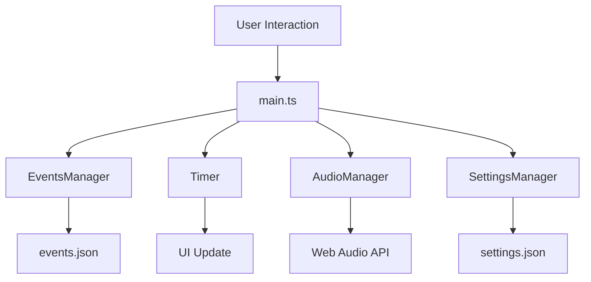

# System Architecture

## Overview

The Event Timer PWA is a modern Single-Page Application (SPA) with the following architecture:

```
┌─────────────────┐    ┌─────────────────┐    ┌─────────────────┐
│   Presentation  │    │   Business      │    │   Data          │
│     Layer       │    │     Logic       │    │     Layer       │
├─────────────────┤    ├─────────────────┤    ├─────────────────┤
│ - main.ts       │    │ - timer.ts      │    │ - events.json   │
│ - index.html    │    │ - audio.ts      │    │ - settings.json │
│ - UI Components │    │ - events.ts     │    │ - localStorage  │
└─────────────────┘    └─────────────────┘    └─────────────────┘
```

## Component Architecture

### Presentation Layer
- **main.ts**: Main application logic, UI management
- **index.html**: HTML structure and PWA manifest
- **UI Components**: Timer display, event list, timeline

### Business Logic Layer
- **Timer**: Timer logic with requestAnimationFrame
- **AudioManager**: Web Audio API and Speech Synthesis
- **EventsManager**: Event management and validation
- **SettingsManager**: Configuration management
- **FaviconGenerator**: Dynamic favicon generation

### Data Layer
- **JSON Files**: Event and settings configuration
- **localStorage**: User settings persistence
- **Service Worker**: Offline caching

## Data Flow



## Timer Architecture

### Precise Time Measurement
```typescript
class Timer {
  private state: TimerState;
  private callbacks: TimerCallbacks;
  private animationId: number | null = null;
  
  start(): void {
    this.state.isRunning = true;
    this.animate();
  }
  
  private animate(): void {
    const now = performance.now();
    const deltaTime = now - this.lastUpdate;
    
    if (deltaTime >= 1000) {
      this.updateTimer();
      this.lastUpdate = now;
    }
    
    this.animationId = requestAnimationFrame(() => this.animate());
  }
}
```

### Event System
- **onTick**: Timer updates
- **onWarning**: 1-minute warning
- **onEnd**: Timer end
- **onEventStart**: Event start

## Audio Architecture

### Web Audio API Integration
```typescript
class AudioManager {
  private audioContext: AudioContext | null = null;
  
  private generateTone(frequency: number, duration: number): void {
    const oscillator = this.audioContext.createOscillator();
    const gainNode = this.audioContext.createGain();
    
    oscillator.connect(gainNode);
    gainNode.connect(this.audioContext.destination);
    
    oscillator.frequency.setValueAtTime(frequency, this.audioContext.currentTime);
    oscillator.start();
    oscillator.stop(this.audioContext.currentTime + duration);
  }
}
```

### Audio Features
- **Warning Sound**: 800Hz Sine-Wave
- **End Sound**: 3x 600Hz Square-Wave
- **Start Sound**: Dramatic sequence
- **Speech Countdown**: Last 10 seconds

## Event Management

### Event Lifecycle
1. **Loading**: Load events from JSON
2. **Validation**: Validate event data
3. **Processing**: Calculate status and timing
4. **Display**: Update UI

### Status Management
```typescript
enum EventStatus {
  UPCOMING = 'upcoming',
  RUNNING = 'running',
  FINISHED = 'finished'
}

function getEventStatus(event: Event): EventStatus {
  const now = new Date();
  const startTime = new Date(event.startTime);
  const endTime = new Date(startTime.getTime() + event.duration * 1000);
  
  if (now < startTime) return EventStatus.UPCOMING;
  if (now >= startTime && now < endTime) return EventStatus.RUNNING;
  return EventStatus.FINISHED;
}
```

## PWA Architecture

### Service Worker
```javascript
// sw.js
const CACHE_NAME = 'event-timer-v1';
const urlsToCache = [
  '/',
  '/index.html',
  '/data/events.json',
  '/data/settings.json'
];

self.addEventListener('install', event => {
  event.waitUntil(
    caches.open(CACHE_NAME)
      .then(cache => cache.addAll(urlsToCache))
  );
});
```

### Manifest
```json
{
  "name": "Event Timer",
  "short_name": "Timer",
  "start_url": "/",
  "display": "standalone",
  "background_color": "#ffffff",
  "theme_color": "#3b82f6",
  "icons": [...]
}
```

## State Management

### Application State
```typescript
interface AppState {
  currentEvent: Event | null;
  currentTimer: Timer | null;
  isFullscreen: boolean;
  theme: 'light' | 'dark';
  audioEnabled: boolean;
  speechEnabled: boolean;
}
```

### State Updates
- **Event Selection**: Navigation to event detail page
- **Timer State**: Start, pause, reset
- **UI State**: Fullscreen, theme, audio

## Performance Optimizations

### Rendering
- **requestAnimationFrame**: For timer updates
- **Debouncing**: For resize events
- **Lazy Loading**: For background images

### Memory Management
- **Event Listener Cleanup**: Automatic cleanup
- **Timer Cleanup**: Animation frame cancellation
- **Audio Context**: Suspend/resume management

### Bundle Optimization
- **Tree Shaking**: Remove unused code
- **Code Splitting**: Lazy loading of components
- **Asset Optimization**: Compress images and icons

## Error Handling

### Graceful Degradation
```typescript
try {
  const audioContext = new AudioContext();
  // Use audio features
} catch (error) {
  console.warn('Audio API not supported:', error);
  // Fallback behavior
}
```

### Error Boundaries
- **Network Errors**: Offline fallback
- **Audio Errors**: Silent execution
- **Timer Errors**: Fallback to setInterval

## Security

### Content Security Policy
```html
<meta http-equiv="Content-Security-Policy" 
      content="default-src 'self'; 
               script-src 'self' 'unsafe-inline'; 
               style-src 'self' 'unsafe-inline' https://fonts.googleapis.com;">
```

### Data Validation
- **Input Sanitization**: JSON validation
- **Type Safety**: TypeScript compiler
- **Runtime Checks**: Event validation

## Testing Architecture

### Test Pyramid
```
    ┌─────────────┐
    │   E2E Tests │ ← Few, important user journeys
    ├─────────────┤
    │Integration  │ ← Component interaction
    │   Tests     │
    ├─────────────┤
    │  Unit Tests │ ← Many, isolated functions
    └─────────────┘
```

### Testing Strategies
- **Unit Tests**: Isolated component tests
- **Integration Tests**: Component interaction
- **E2E Tests**: Complete user journeys

## Deployment Architecture

### Build Pipeline
```
Source Code → TypeScript Compilation → Bundle → Minification → Deployment
```

### CI/CD Pipeline
```
Push → Tests → Build → Deploy → GitHub Pages
```

### Environment Configuration
- **Development**: Hot reload, debug mode
- **Production**: Optimized bundle, service worker
- **Testing**: Mock APIs, test data

## Monitoring & Analytics

### Performance Monitoring
- **Core Web Vitals**: LCP, FID, CLS
- **Custom Metrics**: Timer accuracy, audio latency
- **Error Tracking**: Console errors, user reports

### User Analytics
- **Event Tracking**: Timer starts, audio interactions
- **Usage Patterns**: Frequently used features
- **Performance Metrics**: Load times, runtime performance
